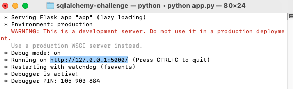

# Surf's Up! Climate API

Prepared by Corey Lawson-Enos

## Summary
* SQLAlchemy code that studies Hawaiian weather station data minimums, maximums, and averages for period 2010-2017. 
* Calculates normals to predict temperature range for future dates as specified by the user. 
* Includes API feature.

## Technologies
SQLAlchemy, Flask, Pandas, NumPy, SciPy, Matplotlib, Jupyter Notebook

## API Access

* Open app.py file from Terminal/Command Prompt: python app.py
* Copy running URL (screenshot below), paste to browser:

## Additional Analysis
* T-test comparing June/December mean temperatures does not show significant difference between the two months, suggesting year-round, temperate weather.

* Sample area plot generator used to predict normals for future periods: 

## Contact
E-mail: clawson131@gmail.com 
LinkedIn: https://www.linkedin.com/in/corey-lawson-enos/
